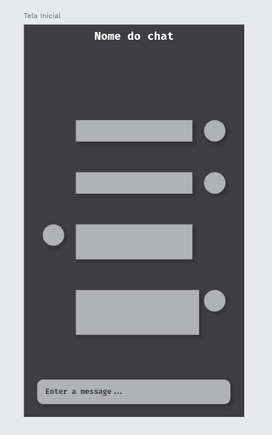

# Web Chat Customizável

Aplicativo de mensagens pensado para desenvolvedores que querem ter mais customizações. O aplicativo tem um chat geral, sendo que cada usuário pode customizar seu uso da forma como preferir.

## Exemplo da tela inicial

As tecnologias usadas serão atualizadas, porém começará sendo HTML, JS e CSS. Sendo assim, sinta-se livre pra testar o aplicativo no seu navegador.